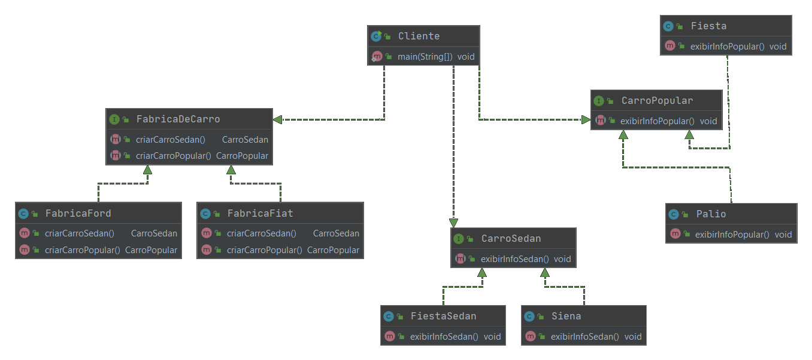

### Abstract Factory

###### Padrão Criacional

Com o padrão Abstract Factory podemos criar famílias de objetos, fazendo com que código cliente fique dependendo de interfaces simples e pequenas ao invés de depender de uma interface grande e que nem todos os métodos seriam utilizados.

##### INTENÇÃO

>“Fornecer uma interface para criação de famílias de objetos relacionados ou dependentes sem especificar suas classes concretas.”

GAMMA, Erich et al. Padrões de Projeto: Soluções reutilizáveis de software orientado a objetos.

##### ESTRUTURA/EXEMPLO

Vamos representar um sistema que, dado um conjunto de carros deve manipulá-los. Precisamos agrupar os carros em conjuntos, ou seja, agrupar objetos que tem comportamentos parecidos. Como abaixo: 

###### Sedan:

Siena – Fiat

Fiesta Sedan – Ford

###### Popular:

Palio – Fiat

Fiesta – Ford

[Exemplo](src)

