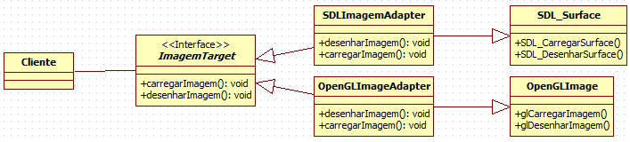

### Adapter

###### Padrão Estrutural

Dado um conjunto de classes com mesma responsabilidade, porém interfaces diferentes, podemos utilizar o Adapter para unificar o acesso a qualquer uma delas. Utilizando um adaptador de objeto bastaria ter uma referência para um objeto da interface e instanciar qualquer uma das subclasses, garantindo  por exemplo, uma integração de código com um sistema legado sem modificar a estrutura do projeto.

##### INTENÇÃO

>“Converter a interface de uma classe em outra interface, esperada pelo cliente. O Adapter permite que interfaces incompatíveis trabalhem em conjunto – o que, de outra forma, seria impossível.”

GAMMA, Erich et al. Padrões de Projeto: Soluções reutilizáveis de software orientado a objetos.

##### ESTRUTURA/EXEMPLO
Client - Target - Adaptee - Adapter

É preciso fazer um sistema que manipule imagens (Target), para isto será utilizado uma API que oferece essas funcionalidades (Adapter). Suponhamos que será necessário ter um método para carregar a imagem de um arquivo(Adaptee) e outro para exibir a imagem na tela.

[Exemplo](src)

