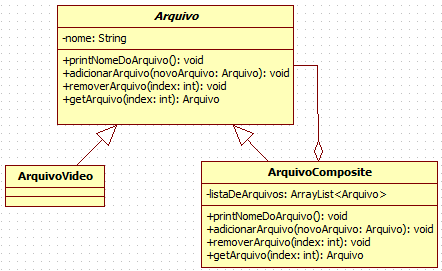

### Composite

Este padrão tem como principio montar uma árvore onde objetos individuais (folhas) e  grupos de objetos (compostos) sejam tratados de maneira igual, ou seja, através da aplicação do polimorfismo realizamos chamadas de objetos na árvore sem se preocupar se o objeto trata-se de uma folha ou de um composto.

##### INTENÇÃO

>“Compor objetos em estruturas de árvore para representarem hierarquias parte-todo. Composite permite aos clientes tratarem de maneira uniforme objetos individuais e composições de objetos.” 

Design Patterns: Elements of Reusable Object-Oriented Software

##### ESTRUTURA/EXEMPLO

Podemos criar um sistema de gerenciamento de arquivos. Com arquivos concretos (vídeos, textos, imagens, etc.) e arquivos pastas, que armazenam outros arquivos.

[Exemplo](https://bit.ly/3cjgSwr)

