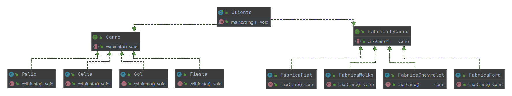

### Factory Method

###### Padrão Criacional

A principal vantagem em utilizar o padrão Factory Method é a extrema facilidade que temos para incluir novos produtos. Apesar de seguir o princípio da responsabilidade única, para cada novo produto precisamos sempre criar duas classes, uma produto e uma fábrica.

##### INTENÇÃO

>“Definir uma interface para criar um objeto, mas deixar as subclasses decidirem que classe instanciar. O Factory Method permite adiar a instanciação para subclasses.”

GAMMA, Erich et al. Padrões de Projeto: Soluções reutilizáveis de software orientado a objetos.

##### ESTRUTURA/EXEMPLO

Precisamos manipular um conjunto de carros em diversas operações. Ao invés de criar objetos diretamente em uma classe concreta, nós definimos uma interface de criação de objetos e cada subclasse fica responsável por criar seus objetos.

[Exemplo](src)

