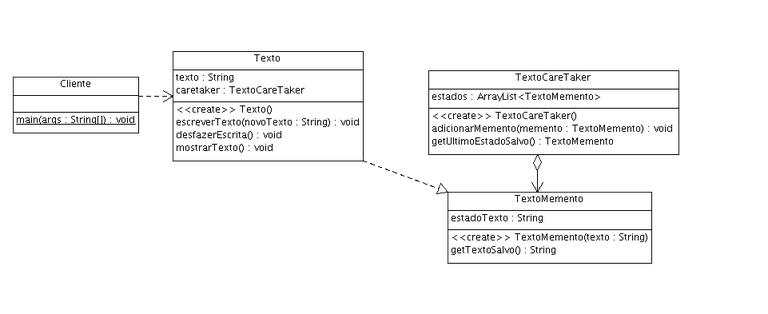

### Memento

###### Padrão Comportamental

O padrão Memento oferece uma maneira simples de salvar estados internos de um objeto. Basta salvar todas as informações necessárias em Memento e mais tarde recuperá-las. Ele transfere a responsabilidade de fornecer maneiras de acessar o estado para o objeto Memento, deixando o Originator livre destas preocupações.

##### INTENÇÃO

>“Sem violar o encapsulamento, capturar e externalizar um estado interno de um objeto, de maneira que o objeto possa ser restaurado para esse estado mais tarde.” 

GAMMA, Erich et al. Padrões de Projeto: Soluções reutilizáveis de software orientado a objetos.

##### ESTRUTURA/EXEMPLO

Vamos pensar em editor de texto que precisa manter o controle apenas do texto que é digitado, um notepad por exemplo. Uma primeira saída poderia ser criar um objeto que representasse o texto com suas informações e guardar estes objetos em uma lista.

[Exemplo](src)

