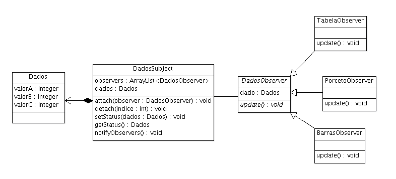

### Observer

###### Padrão Comportamental

No padrão Observer temos duas classes principais: Subject e Observer. O Subject é o que mantém os dados compartilhados e a lista de observadores que compartilham o dado. O Observer é o que faz utilização dos dados compartilhados e deve ser atualizado a cada modificação.
##### INTENÇÃO

>“Definir uma dependência um para muitos entre objetos, de maneira que quando um objeto muda de estado todos os seus dependentes são notificados e atualizados automaticamente.” 

GAMMA, Erich et al. Padrões de Projeto: Soluções reutilizáveis de software orientado a objetos.

##### ESTRUTURA/EXEMPLO

Subject - Observer

Em um programa é necessário fazer várias representações de um mesmo conjunto de dados. Este conjunto de dados consiste de uma estrutura que contém 3 atributos: valorA, valorB e valorC. É necessário representar dados em uma tabela, que simplesmente exibe os número, uma representação em gráficos de barras, onde os valores são exibidos em barras e outra representação em porcentagem, relativo a soma total dos valores. A representação deve ser feita de modo que qualquer alteração no conjunto de dados compartilhados provoque alterações em todas as formas de representação, garantindo assim que uma visão nunca tenha dados invalidados.
Também queremos que as representações só sejam redesenhadas somente quando necessário. Ou seja, sempre que um valor for alterado.

[Exemplo](src)

