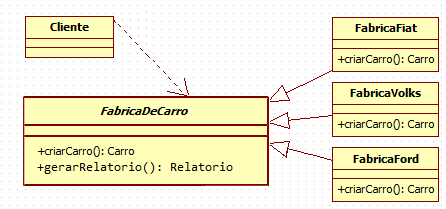

### Singleton

###### Padrão Criacional

A maior vantagem do Singleton é unificar o acesso das instâncias, além disso  não é preciso nem mesmo criar referências para classes Singleton. Encapsular o recurso compartilhado em uma classe Singleton torna muito mais fácil sincronizar o acesso, ao mesmo tempo que nós unificamos o acesso aos recursos, nós compartilhamos todos eles. É composto pela classe Singleton e o Cliente.

##### INTENÇÃO

>“Garantir que uma classe tenha somente uma instância e fornece um ponto global de acesso para a mesma.”  

GAMMA, Erich et al. Padrões de Projeto: Soluções reutilizáveis de software orientado a objetos.

##### ESTRUTURA/EXEMPLO
Client - Singleton

Imagine uma fábrica de carros (Singleton). A classe fábrica centraliza a criação de objetos carro. Por exemplo, se fosse necessário armazenar quantos carros foram criados, para elaborar um relatório de quais foram os carros mais vendidos, seria bem simples não? Bastaria adicionar um contador para cada tipo de carro e, ao executar o método que cria um carro, incrementar o contador referente a ele.

[Exemplo](src)

 .