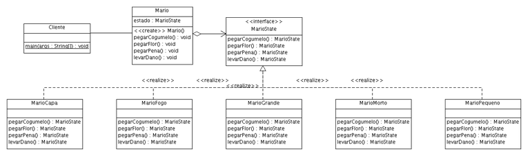

### State
###### Padrão Comportamental

O padrão State vai alterar o comportamento de um objeto quando houver alguma mudança no seu estado interno, como se ele estivesse mudando de classe

##### INTENÇÃO

>“Permite a um objeto alterar seu comportamento quando seu estado interno muda. O objeto parecerá ter mudado de classe.”

GAMMA, Erich et al. Padrões de Projeto: Soluções reutilizáveis de software orientado a objetos.

##### ESTRUTURA/EXEMPLO

Context - State - ConcreteState

Podemos utilizar como um exemplo bem fácil de entender o famoso jogo Mario Bros. Durante o jogo o personagem pode adquirir diferentes habilidades, alterando seu estado interno, fazendo com que sua aparencia e habilidades mudem. As vezes um mesmo item capturado dependendo do estado atual do personagem pode desencadear um novo estado para a personagem.

[Exemplo](src)

