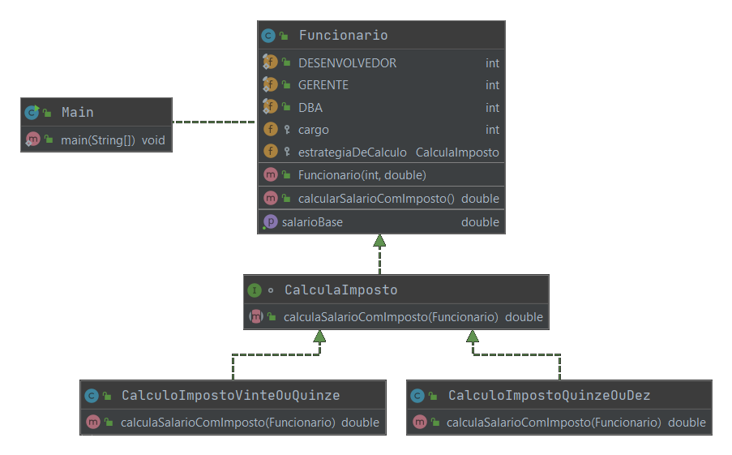

### Strategy
###### Padrão Comportamental

O padrão Strategy sugere que algoritmos parecidos, sejam separados de quem os utiliza.

##### INTENÇÃO

>“Definir uma família de algoritmos, encapsular cada uma delas e torná-las intercambiáveis. Strategy permite que o algoritmo varie independentemente dos clientes que o utilizam” 

GAMMA, Erich et al. Padrões de Projeto: Soluções reutilizáveis de software orientado a objetos.

##### ESTRUTURA/EXEMPLO

Context - Strategy - ConcreteStrategy

Podemos utilizar como exemplo uma empresa, onde os cáculos de impostos é realizado de maneira diferente para cada cargo, retirando o valor do salário do colaborador de acordo com seu salário base. Suponhamos que vamos incluir um novo cargo que utilize o mesmo cálculo de um cargo existente, até aqui tudo bem pois podemos utilizar um if e reutilizar a mesma função para cálcular os impostos do novo cargo. Mas e se futuramente precisarmos realizar um ajuste no cálculo apenas desse novo cargo? Ai entra o Strategy, vamos encapsular todos os algoritmos da mesma família, e assim definir a estratégia para utilização de cada algoritmo.  

[Exemplo](src)

